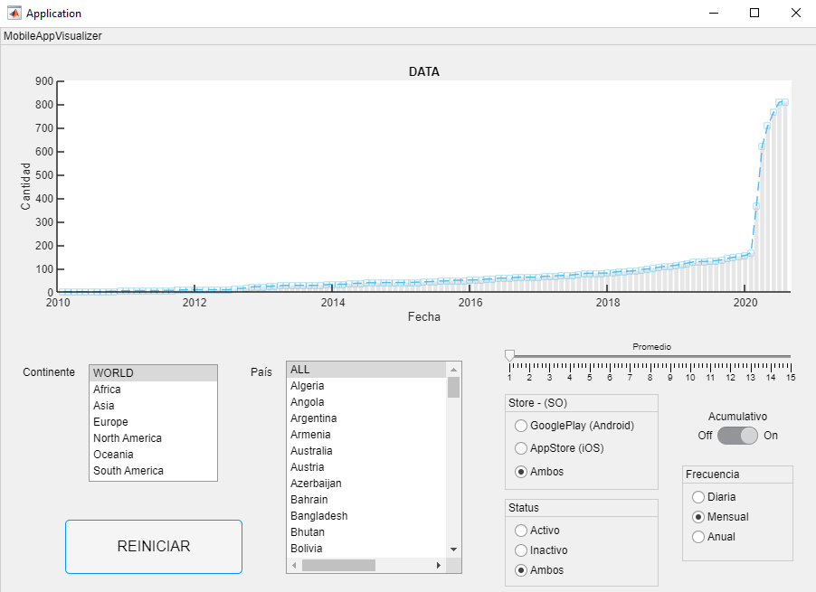

# Proyecto Final - MATLAB y PYTHON

## Objetivos de aprendizaje
- Aplicar nuevas habilidades a un problema del mundo real
- Sintetizar las técnicas aprendidas  
  

## Herramientas
 
- Git
- GitHub
- Python v3.9
  - libs (pandas, numpy)
- MATLAB - AppDesigner (GUI)  
  

## Organización de carpetas

```
./
│   LICENSE
│   main.mlapp                      # MATLAB Graphical App
│   README.md
│   requirements.txt
│
├───data                            # Dir with data source
│       CountryCodes.csv            # Country codes with conventional formats
│       COVID-19_mobile_apps.csv    # Data raw
│
├───env                             # Python3.9 virtual environment
│
└───src
        cargar_data.py              # Python function to process and load data
        DatasetManager.m            # MATLAB Class to manage data
        gestor_de_data.py           # Python function to filter dataframe
```


## Descripción

MobileAppVisualizer es una aplicación desarrollada con MATLAB y Python que procesa la información del dataset [COVID-19_mobile_apps](https://github.com/ec-jrc/covid-19-mobile-apps/tree/main/data)
para su visualización y manipulación mediante una interfaz gráfica interactiva. Esta aplicación le facilita al usuario la tarea de filtrar la información empleando distintos criterios.  
La aplicación gráfica está desarrollada utilizando el entorno integrado de MATLAB AppDesigner que permite diseñar la interfaz gráfica de usuario y a su vez determinar el comportamiento de la aplicación mediante código. Por otro lado, Python se emplea con la finalidad de facilitar el procesamiento de la información mediante el uso de la librería pandas que sirve para crear una estructura de datos flexible (dataframe). Pandas permite filtrar la información del dataframe de una forma ágil y para la aplicación de MobileAppVisualizer se lo hace dependiendo de las interacciones que el usuario tenga con la interfaz gráfica.  
La interfaz gráfica cuenta con elementos para filtrar la información de las aplicaciones móviles para Covid 19 dependiendo del continente, el país, la tienda digital (GooglePlay o AppStore), el estatus de la aplicación (activo o inactivo), una frecuencia periódica (días, meses, años), una suma acumulativa de los datos y un promedio móvil de la información.

> A continuación se muestra la ventana principal de la aplicación. 

<div align="center">

</div>


> Enlace a videotutorial
<div align="center">
<a href="http://purl.org/matlabintermedio/proyectofinal/demostracion" target="_blank">

</a>
<p>Demostración de funcionamiento</p>
</div>

<br/><br/>


## Versiones y evoluciones del producto

**Versión 1.0 Febrero 2022**

- Actualización de la gráfica (Plot) con las interacciones del usuario
- Interacción con los elementos de la interfaz gráfica de usuario
- Presentación de información en la gráfica (Plot)
- Gestión de la información manejada por la aplicación
- Comunicación de MATLAB con funciones de Python
- Filtrar datos por medio de distintos criterios
- Procesar datos desde un archivo csv